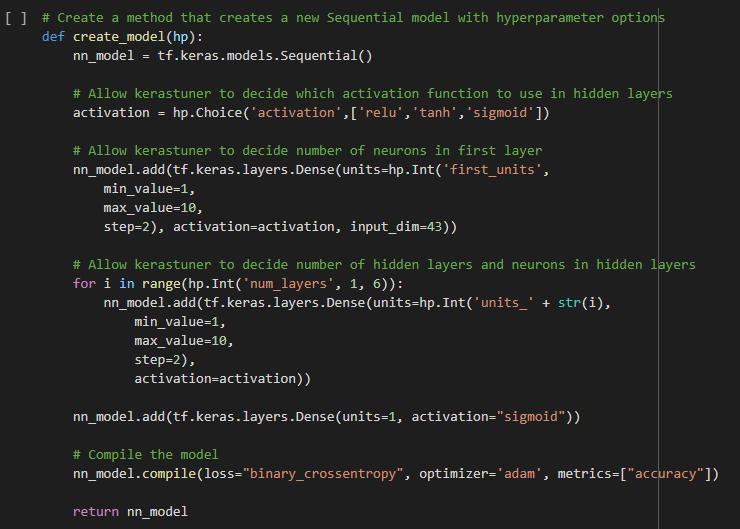

# Alphabet Soup Charity Analysis Report
## Overview of the analysis:
The nonprofit foundation Alphabet Soup wants a tool that can help it select the applicants for funding with the best chance of success in their ventures. With your knowledge of machine learning and neural networks, you’ll use the features in the provided dataset to create a binary classifier that can predict whether applicants will be successful if funded by Alphabet Soup. 
From Alphabet Soup’s business team, we received a CSV containing more than 34,000 organisations that have received funding from Alphabet Soup over the years. 
Alphabet Soup are requesting a result of greater than 75%.

## Results: 
### Data Preprocessing
* What variable(s) should be removed from the input data because they are neither targets nor features?
    * **EIN** and **NAME** were removed from the dataset 
* What variable(s) are the target(s) for your model?
    * The Variable **IS_SUCCESSFUL** was chosen as the target
* What variable(s) are the features for your model?
    * **APPLICATION_TYPE, AFFILIATION, CLASSIFICATION, USE_CASE, ORGANIZATION, STATUS, INCOME_AMT, SPECIAL_CONSIDERATIONS, ASK_AMT**
     

* Determine the number of unique values for each column.
* Determine the count of unique values (data points) For the classification and application_type columns 
* A cutoff value of **<500** was chosen for the Application_Type data points. These were then put into a list ‘other’ for binning.
 

* A cutoff value of **<1000** was chosen for the Classification data points. These were then put into a list ‘other’ for binning.
* Categorical data was then converted to numeric data via get_dummies.
Values were then split into the target and feature arrays.
These were then split into training and test datasets.

### Compiling, Training, and Evaluating the Model
##### Model 1 
* Two Hidden layers were created along with one output layer 80 neurons were used in the first layer and 30 were used in the second layer. Relu was used for the hidden layers and sigmoid was used for the output layer. The total epochs used were 100
* The target model performance was requested to be greater than 75%. This was not achieved using this model. 72.79%

##### Model 2:
A second model was created using the already preprocessed data of the original model. The cutoff value for Classification data points changed to <700.

Two Hidden layers were created along with one output layer 80 neurons were used in the first layer and 30 were used in the second layer. Tanh was used for the hidden layers and sigmoid was used for the output layer. The total epochs used were 200.
The target model performance was requested to be greater than 75%. This was not achieved using this model. 73.13%

##### Model 3:
A third model was created using the already preprocessed data of the original model.

I decided to choose a different option and went with a method that creates and compiles a new Sequential deep learning model with hyperparameter options.

* I requested the KerasTuner to select between ReLU, tanh and sigmoid activation functions for each hidden layer.
* 1 to 10 neurons were set for the first layer.
* The tuner runtime, was set to 5.
* 1 to 6 hidden layers and 1 to 10 neurons were set for the hidden layers.

The KerasTuner library was imported and a Hyperband tuner instance was created. The following parameters were set:
* The objective is "val_accuracy"
* max_epochs equal to 20
* hyperband_iterations equal to two

The target model performance was requested to be greater than 75%. This was not achieved using this model. 73.00%

### Summary: 
The three models created showed little variance in the final performance value and were all below the requested result of greater than 75%.
* Model 1: 72.79%
* Model 2: 73.13%
* Model 3: 73.00%

Further investigation into the model is required. The number of layers/neurons and activation modes may assist in obtaining the required result of 75% or greater.

